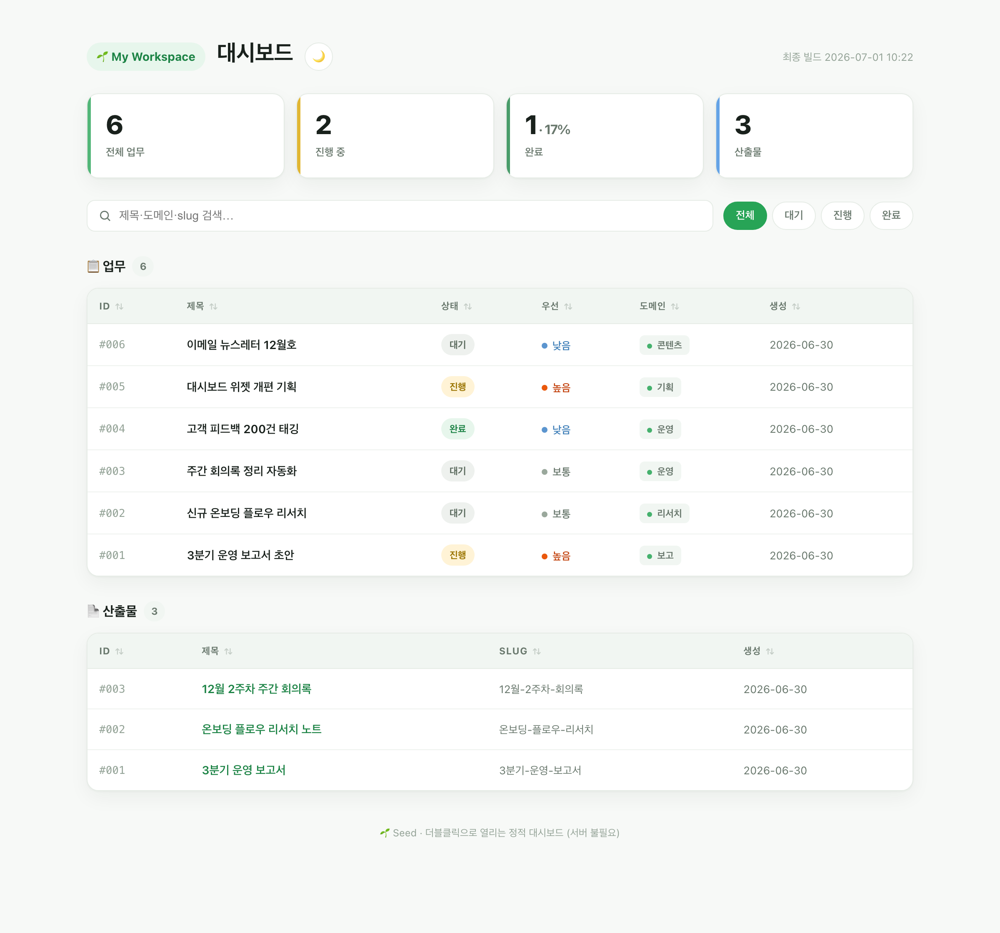
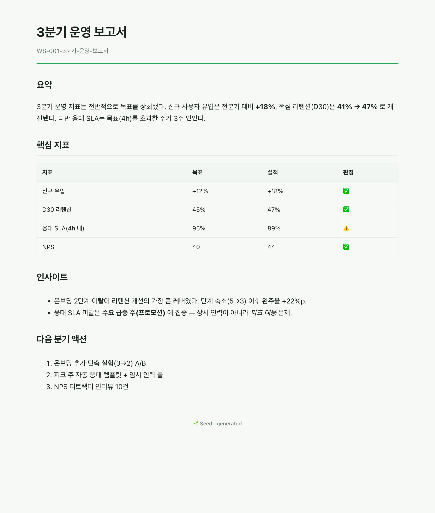

<div align="center">

# 🌱 Seed

**인터뷰 한 번으로, 당신의 업무에 맞는 Claude Code 워크스페이스가 자란다.**

*Plant once. Grow your own workspace.*

[](https://github.com/hanmariyang/seed-workspace-kit/generate)
[](https://github.com/hanmariyang/seed-workspace-kit/actions/workflows/ci.yml)
[](#4대-원칙)
[](LICENSE)

</div>

---

## 결과물 미리보기

저장하면 **소스(`.md`) + 렌더(`.html`)** 가 동시에 생기고, 그때마다 대시보드가 다시 그려집니다. 서버 없이 더블클릭으로 열립니다.



> 통계(전체·진행·완료율·산출물) · 검색 · 상태 필터 · 컬럼 정렬 · 라이트/다크 토글이 들어간 정적 대시보드. 데이터가 HTML에 박혀 있어 `file://` 더블클릭만으로 동작 (서버 불필요). 액센트 색·기본 모드는 `seed.json` 의 `theme` 한 줄로 바뀝니다.

| 산출물 문서 (md→html) | 라이브 데모 |
|---|---|
|  | **[docs/demo/](docs/demo/deliverables/_dashboard.html) 를 브라우저로 열어보세요** — 위 스크린샷을 실제로 클릭·검색·정렬할 수 있는 박제 워크스페이스입니다. |

> 🎨 **대시보드 카탈로그 — [docs/dashboard-catalog/](docs/dashboard-catalog/index.html)**
> 같은 데이터를 10가지 방식으로 빚은 대시보드 시안 모음(테이블·칸반·갤러리·차트·타임라인·기여 그래프·다크 집중·리뷰 등). 마음에 드는 한 컨셉을 골라 채택하세요. 전부 의존성 0 · 더블클릭으로 열리는 자기완결 단일 파일.

---

## Seed 가 뭔가요

처음 Claude Code 를 쓰는 사람이 **자기 업무에 맞는 워크스페이스**를 세팅하도록 돕는 **템플릿 repo** 입니다.

빈 폴더에서 시작하는 대신, Seed 를 템플릿으로 새 repo 를 만들고 `/onboard` 를 한 번 부르면 — 건축 에이전트가 6~8개를 인터뷰하고, 그 답으로 디렉토리·로컬 DB·전용 조력 에이전트·코어 스킬·산출물 뷰어를 **맞춤 생성**합니다. 마지막엔 첫 산출물 하나를 즉석에서 만들어 브라우저에 띄워 보여주고 물러납니다.

> **핵심 철학 — "복사가 아니라 인터뷰".**
> 남의 워크스페이스를 통째로 복사하면 내 업무와 안 맞아 방치됩니다. Seed 는 *당신을 인터뷰해서* 당신 것을 만듭니다.

---

## 무엇이 다른가 — 두 계보의 혼합

Seed 는 두 가지 잘 알려진 방식을 합칩니다.

| 계보 | 가져온 것 |
|---|---|
| **원탁 (Round Table) 워크스페이스** | `CLAUDE.md` 정체성 · `.claude/agents`·`skills` · 산출물 **md+html 이중 저장** · 업무 파이프라인 |
| **Andrej Karpathy (LLM Wiki + 미니멀리즘)** | `wiki/` **플랫 마크다운 지식베이스**(RAG 없음, git 버전관리, 어떤 LLM이든 읽음) · 단일 파일 도구 · **의존성 0** · `PROGRAM.md` 아이디어 파일 |

그 결과 하나의 원칙이 나옵니다:

> **상태(state)는 DB, 지식(knowledge)은 플랫 마크다운.**
> 변하는 구조화 데이터(업무·산출물 메타)는 `workspace.db`(SQLite) 에. 쌓이는 텍스트 지식(정책·배운 것·결정 이유)은 `wiki/*.md` 평문에. 평문은 실패 모드가 없고, 띄울 서비스가 없고, git 으로 버전되고, 어떤 LLM이든 그냥 읽습니다.

---

## 4대 원칙

1. **의존성 0 진입** — Python 표준 라이브러리(`sqlite3`)만으로 동작. `pip install` 없이 시작
2. **소스 + 렌더 동시 보존** — 모든 산출물은 `.md`(소스) + `.html`(렌더) 쌍으로
3. **최소 골격** — 조력 에이전트 1~2명, 코어 스킬 3개. 과설계 금지. 필요해지면 자란다
4. **승격 경로만 열어둠** — SQLite→Postgres, 정적→서버, 1인→다인 전환은 *안내만*, 강제 X

---

## 생성되는 구조

```
my-workspace/
├── CLAUDE.md              # 정체성·규칙·조력자 정의 (인터뷰로 생성)
├── PROGRAM.md             # 워크스페이스 "아이디어 파일" — 작동 원리 + 개선 로그
├── .claude/
│   ├── agents/            # 인터뷰가 낳은 조력자 1~2명
│   ├── skills/            # /task · /deliver · /view
│   └── settings.json
├── workspace.db           # [상태] SQLite — tasks · deliverables 메타
├── wiki/                  # [지식] 플랫 마크다운 지식베이스 (RAG 없음)
│   ├── index.md
│   └── *.md               # 한 파일 = 한 주제
├── bin/
│   ├── ws.py              # DB 헬퍼 CLI (단일 파일, 의존성 0)
│   └── render.py          # md→html 렌더러 + 대시보드 빌더
├── deliverables/          # slug.md + slug.html 쌍
│   ├── _dashboard.html    # 자동 생성 대시보드 (더블클릭으로 열림)
│   └── _assets/
├── notes/inbox/           # 분류 전 메모 → 정제되면 wiki/ 로 승격
└── archive/
```

---

## 두 개의 파이프라인

### `/onboard` — 워크스페이스 건축 (1회성)
```
인터뷰 → 설계 → 생성 → 첫 산출물 시연 → 점화 후 물러남
```
`workspace-architect` 에이전트가 운전. 빈 구조가 아니라 *이미 한 번 돌아간* 워크스페이스를 넘깁니다.

### `/deliver` — 일상 운영 (반복)
```
Capture → Route → Execute → Persist(md+html+DB+wiki) → Report(대시보드 재빌드)
```
인터뷰가 낳은 조력 에이전트가 운전. 모든 산출은 이중 저장되고, 저장 즉시 대시보드가 다시 그려집니다.

---

## 명명 규약 (기본값, 인터뷰에서 확정)

| 대상 | 패턴 | 예시 |
|---|---|---|
| 산출물 폴더 | `{PREFIX}-{id:03d}-{slug}` | `WS-007-3분기-보고서` |
| 산출물 파일 | `{slug}.md` · `{slug}.html` | `3분기-보고서.md` |
| wiki 지식 | `{topic-slug}.md` | `정산-정책.md` |
| 빠른 메모 | `{YYYY-MM-DD}-{slug}.md` | `2026-06-26-아이디어.md` |

- **PREFIX** 는 워크스페이스 이름에서 자동 도출 · **slug 한글 유지 기본**(영문 전환 가능)
- 건축가가 인터뷰에서 **제안하고**, 사용자가 **단일 질문으로 확정**. 확정 후 `bin/ws.py` 가 강제

---

## 빠른 시작

```bash
# 1) Seed 템플릿으로 새 워크스페이스 repo 생성 ("Use this template" 버튼 또는)
gh repo create my-workspace --template hanmariyang/seed-workspace-kit --private --clone
cd my-workspace

# 2) Claude Code 에서 온보딩 — 인터뷰가 시작됩니다
/onboard

# 3) 끝나면 대시보드가 뜹니다. 이후엔:
/task    "이번 주 할 일 등록"
/deliver "3분기 보고서 초안"
/view    # 대시보드 열기
```

**손으로 먼저 보고 싶다면** (Claude Code 없이도):

```bash
python bin/ws.py init
python bin/ws.py add "첫 할 일" --domain 운영 --priority 1
python bin/ws.py deliver "첫 산출물"
open deliverables/_dashboard.html
```

---

## 로드맵

| Phase | 내용 | 상태 |
|---|---|---|
| P0 | 설계 + 건축 에이전트 | ✅ |
| P1 | 골격 + DB (`bin/ws.py`) | ✅ |
| P2 | 뷰어 (`bin/render.py` + 테마) | ✅ |
| P3 | 스킬 3종 (`/task` `/deliver` `/view`) | ✅ |
| P4 | 온보딩 (`/onboard`) | ✅ |
| P5 | 패키징 (템플릿 repo + 가이드) | ✅ |

---

## 더 보기

- 전체 설계: [`docs/DESIGN.md`](docs/DESIGN.md) — 원탁 × Karpathy 혼합, 파이프라인, 명명 규약
- 대시보드 카탈로그: [`docs/dashboard-catalog/`](docs/dashboard-catalog/index.html) — 10개 컨셉 시안 (브라우저로 열기)
- 프로젝트 포스터: [`docs/poster.html`](docs/poster.html) (브라우저로 열기)
- 라이선스: [`LICENSE`](LICENSE) (MIT)

자세한 작동 원리는 `PROGRAM.md`, 정체성·규칙은 `CLAUDE.md`.

---

## 기여 & 커뮤니티

Seed 는 **작게 유지되는 것**을 목표로 합니다. 기여를 환영해요 🌱

- 🤝 기여 방법: [`CONTRIBUTING.md`](CONTRIBUTING.md) — 개발 환경·브랜치·PR 규칙, 지켜야 할 4대 원칙
- 📜 행동 강령: [`CODE_OF_CONDUCT.md`](CODE_OF_CONDUCT.md) — Contributor Covenant 2.1
- 🔒 보안 제보: [`SECURITY.md`](SECURITY.md) — 취약점은 공개 이슈 대신 비공개 채널로
- 🗒️ 변경 이력: [`CHANGELOG.md`](CHANGELOG.md)
- 💬 질문·아이디어: [Discussions](https://github.com/hanmariyang/seed-workspace-kit/discussions)

기여 전 큰 변경은 **이슈로 먼저 제안**해 방향을 맞춰주세요.

---

<div align="center">
<sub>🌱 Seed — 인터뷰로 심고, 워크스페이스로 키운다.</sub>
</div>
